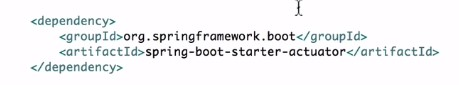

# Spring microservices getting started
Create an arch maven project and add the next to pom.xml
```
<parent>
  	<groupId>org.springframework.boot</groupId>
  	<artifactId>spring-boot-starter-parent</artifactId>
  	<version>1.4.2.RELEASE</version>
  </parent>
  
  <dependencies>
	<dependency>
		<groupId>org.springframework.boot</groupId>
  		<artifactId>spring-boot-starter-web</artifactId>
  	</dependency>
  </dependencies>
  
  <properties>
  	<java.version>1.8</java.version>
  </properties>
```
Decorate your main class
```
package com.codingindfw.springbootstarter;

import org.springframework.boot.SpringApplication;
import org.springframework.boot.autoconfigure.SpringBootApplication;

@SpringBootApplication
public class CourseApiApp {
	
	public static void main(String[] args) {
		SpringApplication.run(CourseApiApp.class, args);
		System.out.println("Hello");
	}

}
```
And voila, your sprin app will be running on port 8080 😀

Now, you need to create a class and decorate it as a rest controller, see next:

```
package com.codingindfw.springbootstarter.hello;

import org.springframework.web.bind.annotation.RequestMapping;
import org.springframework.web.bind.annotation.RestController;

@RestController
public class HelloController {

	@RequestMapping("/hello")
	public String sayHi() {
		return "Hello";
	}
}
```

Click on [localhost:8080/hello](https://localhost:8080/hello) to see the magic happening.


create a topic class as it follows:
```
package com.codingindfw.springbootstarter.topic;

public class Topic {
	private int id;
	private String name;
	private String description;
	
	public Topic() {
	}
	
	public Topic(int id, String name, String description) {
		super();
		this.id = id;
		this.name = name;
		this.description = description;
	}
	
	public int getId() {
		return id;
	}
	public void setId(int id) {
		this.id = id;
	}
	public String getName() {
		return name;
	}
	public void setName(String name) {
		this.name = name;
	}
	public String getDescription() {
		return description;
	}
	public void setDescription(String description) {
		this.description = description;
	}
}
```
modify the getAllTopics() method in the controller:

```
@RequestMapping("/topics")
	public List<Topic> getAllTopics() {
		
		return Arrays.asList(
				new Topic(1, "java", "intro to java"),
				new Topic(2, "spring", "intro to spring"),
				new Topic(3, "asp", "intro to asp.net"),
				new Topic(4, "swagger", "intro to swagger")
				);
	}
```
visit the url and spring again does the magic for you:


## Creating a service

Create a service and move the list of topics to it
```
package com.codingindfw.springbootstarter.topic;

import java.util.Arrays;
import java.util.List;

import org.springframework.stereotype.Service;

@Service
public class TopicService {
	private List<Topic> topics = Arrays.asList(
			new Topic(1, "java", "intro to java"),
			new Topic(2, "spring", "intro to spring"),
			new Topic(3, "asp", "intro to asp.net"),
			new Topic(4, "swagger", "intro to swagger")
		);
	
	public List<Topic> getAllTopics(){
		return this.topics;
	} 
}

```
Then spring will inject the server into our controller if we rewrite the controller as it follows:
```
package com.codingindfw.springbootstarter.topic;

import java.util.Arrays;
import java.util.List;

import org.springframework.beans.factory.annotation.Autowired;
import org.springframework.web.bind.annotation.RequestMapping;
import org.springframework.web.bind.annotation.RestController;

@RestController
public class TopicController {
	
	@Autowired
	private TopicService topicService;
	
	@RequestMapping("/topics")
	public List<Topic> getAllTopics() {
		
		return topicService.getAllTopics(); 
	}
}

```

The output when visiting the url will be the same


## Request an item from the collection

Define a method in the controller. Note the use of @PathVariable to map that part of the url to our ```int``` id.
```
.....
@RequestMapping("/topics/{id}")
public Topic getTopic(@PathVariable int id) {
	return topicService.getTopic(id); 
}
```
Define a method in the server as it follows:
```
...
public Topic getTopic(int id){
	return this.topics.stream().filter(t -> new Integer(t.getId()).equals(id)).findFirst().get();
}
```


## Adding an item to the collection

Define a method in the controller. Use ```@RequestBody``` to get the body as json

```
@RequestMapping(method=RequestMethod.POST, value="/topics")
public Topic addTopic(@RequestBody Topic topic) {
	return topicService.addTopic(topic); 
}
```
Change the list to a mutable object.
```
private List<Topic> topics = new ArrayList<>(
			Arrays.asList(
						new Topic(1, "java", "intro to java"),
						new Topic(2, "spring", "intro to spring"),
						new Topic(3, "asp", "intro to asp.net"),
						new Topic(4, "swagger", "intro to swagger")
					)
			);
```
create a method in the service:
```
public Topic addTopic(Topic topic){
	this.topics.add(topic);
	return topic;
}
```
Sent a json object into the body to the api using the POST verb:


## Update and delete an item

Define the method in the controller:
```
@RequestMapping(method=RequestMethod.PUT, value="/topics/{id}")
public Topic updateTopic(@PathVariable int id,@RequestBody Topic topic) {
	return topicService.updateTopic(id, topic); 
}
```
Define the method in the service:
```
public Topic updateTopic(int id, Topic topic) {
	int index = this.topics.indexOf(this.topics.stream().filter(t -> new Integer(t.getId()).equals(id)).findFirst().get());
	this.topics.set(index, topic);
	return this.topics.get(index);
}
```
Make the request using your favorite rest client:


The delete method follows a similar approach:
```
@RequestMapping(method=RequestMethod.DELETE, value="/topics/{id}")
public void updateTopic(@PathVariable int id) {
	topicService.deleteTopic(id); 
}
```
In the service:
```
public void deleteTopic(int id) {
	int index = this.topics.indexOf(this.topics.stream().filter(t -> new Integer(t.getId()).equals(id)).findFirst().get());
	this.topics.remove(index);
}
```


Change the port creating a file named ```application.properties``` 
and writing ```server.port=5000``` into it. Consult the [documentation](https://docs.spring.io/spring-boot/docs/current/reference/html/appendix-application-properties.html#security-properties) for more properties.

You can add a method to the service to filter entities by field making sure the spring convention is respected. Will start find ```find``` then the ```ClassName``` followed by ```By```, and at the end the field you want to filter upon ```Field```. In the next example the method will filter Topics by Name: 
```
public List<Topic> findTopicByName();
```
> Make sure to use camel case when naming these methods.

## Relationships
Declare ```many to many``` relationships using the @ManyToMany decorator on top of the field that points to another class. Ex:
```
@Entity
@Table(name = "posts")
public class Post {
    @Id
    @GeneratedValue(strategy = GenerationType.IDENTITY)
    private Long id;

    @NotNull
    @Size(max = 100)
    @Column(unique = true)
    private String title;

    @NotNull
    @Size(max = 250)
    private String description;

    @NotNull
    @Lob
    private String content;


    @ManyToMany(fetch = FetchType.LAZY,
            cascade = {
                CascadeType.PERSIST,
                CascadeType.MERGE
            })
    @JoinTable(name = "post_tags",
            joinColumns = { @JoinColumn(name = "post_id") },
            inverseJoinColumns = { @JoinColumn(name = "tag_id") })
    private Set<Tag> tags = new HashSet<>();


    public Post() {

    }

    public Post(String title, String description, String content) {
        this.title = title;
        this.description = description;
        this.content = content;
    }

    // Getters and Setters (Omitted for brevity)
}
```
Now the tags ```Entity```:

```
@Entity
@Table(name = "tags")
public class Tag {
    @Id
    @GeneratedValue(strategy = GenerationType.IDENTITY)
    private Long id;

    @NotNull
    @Size(max = 100)
    @NaturalId
    private String name;

    @ManyToMany(fetch = FetchType.LAZY,
            cascade = {
                CascadeType.PERSIST,
                CascadeType.MERGE
            },
            mappedBy = "tags")
    private Set<Post> posts = new HashSet<>();

    public Tag() {

    }

    public Tag(String name) {
        this.name = name;
    }

    // Getters and Setters (Omitted for brevity)
}
```
> SNotice how the ```many to many``` decorator is used in both tables. More details at this excellent tutorial [JPA / Hibernate / MySQL Many to Many Mapping Example with Spring Boot](https://www.callicoder.com/hibernate-spring-boot-jpa-many-to-many-mapping-example/)

A similar approach is followed for ```many to one``` relationship.

## Deployment
To create a self contained jar file of the project, run:
```
~/spring-boot-project $ mvn clean install
```


Then, to run the service  java -jar target/course-api-0.0.1-SNAPSHOT.jar


## Adding actuator
Go to the pom.xml and add the actuator dependency:



It will make add ```/health``` endpoint to your app where you can see some common stats of your app:


Change the port for the actuator to avoid conflicts with your apis URLs in application.propperties as:

```
management.port: 9001
```

Then you can access to all the endpoints of the actuator. See more at the [spring actuator official documentation](https://docs.spring.io/spring-boot/docs/current/actuator-api/html/).